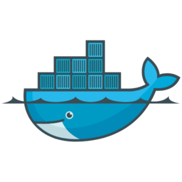

# Requirements

<div><figure><figcaption></figcaption></figure> <figure><figcaption></figcaption></figure> <figure><figcaption></figcaption></figure> <figure><figcaption></figcaption></figure> <figure><figcaption></figcaption></figure> <figure><figcaption></figcaption></figure> <figure><figcaption></figcaption></figure></div>

## <mark style="color:$primary;">Linux Requirements</mark>

### Kernel Version

**Minimum:** Linux kernel v5.10 (Amazon 2 Linux).

**Recommended:** v6.2 or higher.

### **Architectures**

* x86\_64
* aarch64


[Contact us for other architectures.](https://www.garnet.ai/about)


### **eBPF support**

Modern distributions (Ubuntu 22.04+, RHEL 9+, etc.) usually provide full eBPF support.

To verify, check if the following kernel configs are enabled:

* `CONFIG_BPF=y`
* `CONFIG_BPF_SYSCALL=y`&#x20;
* `CONFIG_HAVE_EBPF_JIT=y`

```sh
zcat /proc/config.gz | grep BPF
```

Alternatively, install `bpftool` and run:

```sh
bpftool feature probe
```

Look for `BPF` and `JIT` features marked as “available”.

### Privileges & Capabilities

**Root access required.**

* **Capabilities needed:**
  * `CAP_BPF` (primary, present in kernel 5.8+)
  * `CAP_SYS_ADMIN` (fallback for older kernels or tools)
  * `CAP_PERFMON` (performance monitoring)
  * `CAP_NET_ADMIN` (network observability)

**How to verify:**

Check current capabilities:

```sh
capsh --print | grep cap_
```

For containerized environments, ensure capabilities are not dropped\
(see [Kubernetes docs](https://kubernetes.io/docs/) or [Docker docs](https://docs.docker.com/)).

## <mark style="color:$primary;">Kubernetes Requirements</mark>

### Cluster Version

* **Minimum:** Kubernetes 1.16+
*   **Check version:**

    ```sh
    kubectl version --short
    ```

### Kubectl Configuration

*   Ensure `kubectl` is installed and configured to communicate with the target cluster:

    ```sh
    kubectl cluster-info
    ```
* You should receive cluster details, not errors.

### Cluster Capabilities

* For cluster-wide deployments, confirm permission to create privileged DaemonSets and grant required Linux capabilities.
* If using managed services (EKS, GKE, AKS), ensure nodes support eBPF and required kernel capabilities (see cloud provider documentation).

## <mark style="color:$primary;">Need Help ?</mark>

Join [#jibril](https://discord.gg/44vSshRqab) or our [#kubernetes](https://discord.gg/pavcuzhuKs) discord channels and ask anything you need!
